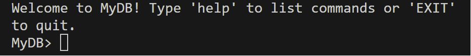

## How to run
### Packages needed
#### A. re 
```
pip install re
```
#### B. csv
```
pip install csv
```
#### C. cmd
```
pip install cmd
```
#### D. traceback
```
pip install traceback
```
#### E. ast
```
pip install ast
```
### Download folder and run ipynb file 
#### ***Download folder***
Run all the cells

### Download folder and run py file 
#### ***Download folder***
```
python3 navsanya_6878418392.py 
```
### Terminal screen



## Test Queries

### help
```
help
```

### GET
```
GET rank,writers FROM TABLE makers WHERE rank is greater than 0 and rank is less than 75
```
```
GET ALL FROM TABLE mediaDeets WHERE rank is at most 80
```

### FIND
```
FIND COUNT OF COLUMN budget FROM TABLE mediaDeets
```
```
FIND AVG OF COLUMN rank FROM TABLE essentials
```

### CREATE
```
CREATE A TABLE myTable WITH THE FOLLOWING COLUMNS: a,b
```

### ADD
```
ADD VALUES 1,hi INTO TABLE myTable IN COLUMN/S a,b
```

### COMBINE
```
COMBINE TABLES testTable,testTableQuery ON a
```

### UPDATE
```
UPDATE TABLE testTable WITH VALUES 99,hello!! IN COLUMN a,b WHERE c is equal to 5.3
```

### DELETE
```
DELETE ROW/S FROM TABLE testTable WHERE c is equal to 5.3
```
### SHOW
```
SHOW TABLE essentials
```

### exit
```
exit
```

## File Descriptions
###  Final Report
* Final Report.gdoc: google doc version
* Final Report.pdf: pdf version
### Test csv files so we can see the results at a more smaller level (easy to understand)

* testTable.csv
* testTableQuery.csv

### IMDBTop250Movies.csv: Complete Database - all columns

### Divided into
* Essentials: rank, name, year
* viewerDeets: rank, rating, genre, tagline, certificate
* mediaDeets: rank, budget, box_office
* makers: rank, casts, directors, writers

## Project Report (Google docs): [link][1] 
[1]: https://docs.google.com/document/d/1DsRMTtiMdslgF0zM87dfLogxBUjrt4ZoNImmXADyowc/edit?usp=sharing
## Project Report (pdf): [link][3]
[3]: https://drive.google.com/file/d/1pUCBxNKPigCeetU4sRaoL1P9FdAl2voY/view?usp=sharing 
## Project Folder: [link][2]
[2]: https://drive.google.com/drive/folders/11Mhnl9HFpHKqHTPsR85P2prLKBj37rdy?usp=sharing 

